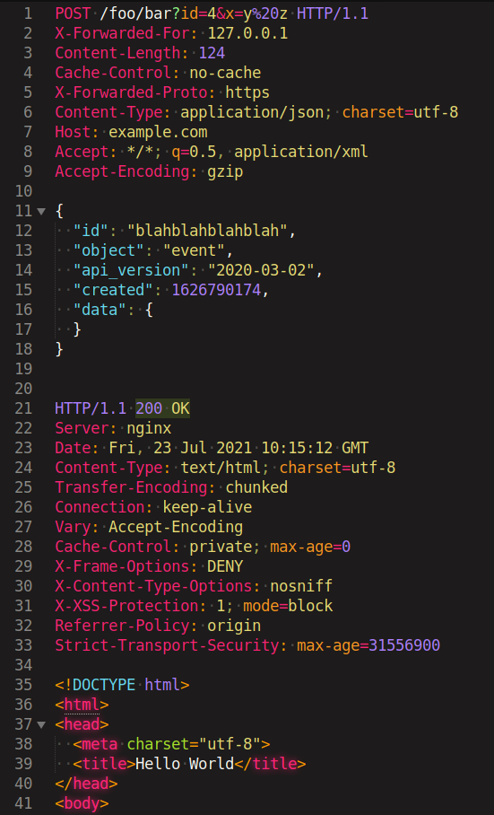

# HTTP Request Response Syntax
This is a sublime-syntax grammar for HTTP Requests and/or Responses.
It was originally designed for use in https://github.com/sharkdp/bat, so it is not using any Sublime Text 4 features, as https://github.com/trishume/syntect does not support them yet. So this package should work in Sublime Text 3 also.

Example highlighting:


<!--
```http
POST /foo/bar?id=4&x=y%20z HTTP/1.1
X-Forwarded-For: 127.0.0.1
Content-Length: 124
Cache-Control: no-cache
X-Forwarded-Proto: https
Content-Type: application/json; charset=utf-8
Host: example.com
Accept: */*; q=0.5, application/xml
Accept-Encoding: gzip

{
  "id": "blahblahblahblah",
  "object": "event",
  "api_version": "2020-03-02",
  "created": 1626790174,
  "data": {
  }
}


HTTP/1.1 200 OK
Server: nginx
Date: Fri, 23 Jul 2021 10:15:12 GMT
Content-Type: text/html; charset=utf-8
Transfer-Encoding: chunked
Connection: keep-alive
Vary: Accept-Encoding
Cache-Control: private; max-age=0
X-Frame-Options: DENY
X-Content-Type-Options: nosniff
X-XSS-Protection: 1; mode=block
Referrer-Policy: origin
Strict-Transport-Security: max-age=31556900

<!DOCTYPE html>
<html>
<head>
  <meta charset="utf-8">
  <title>Hello World</title>
</head>
<body>

</body>
</html>
```
-->
